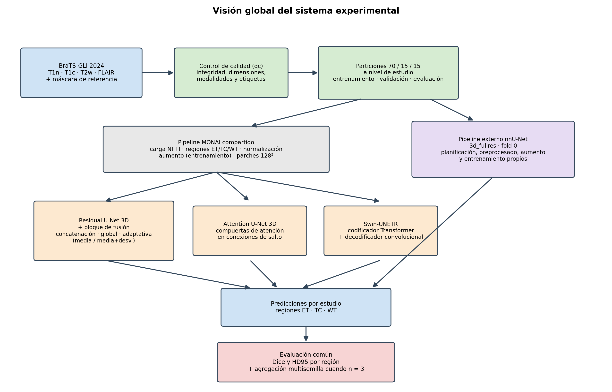
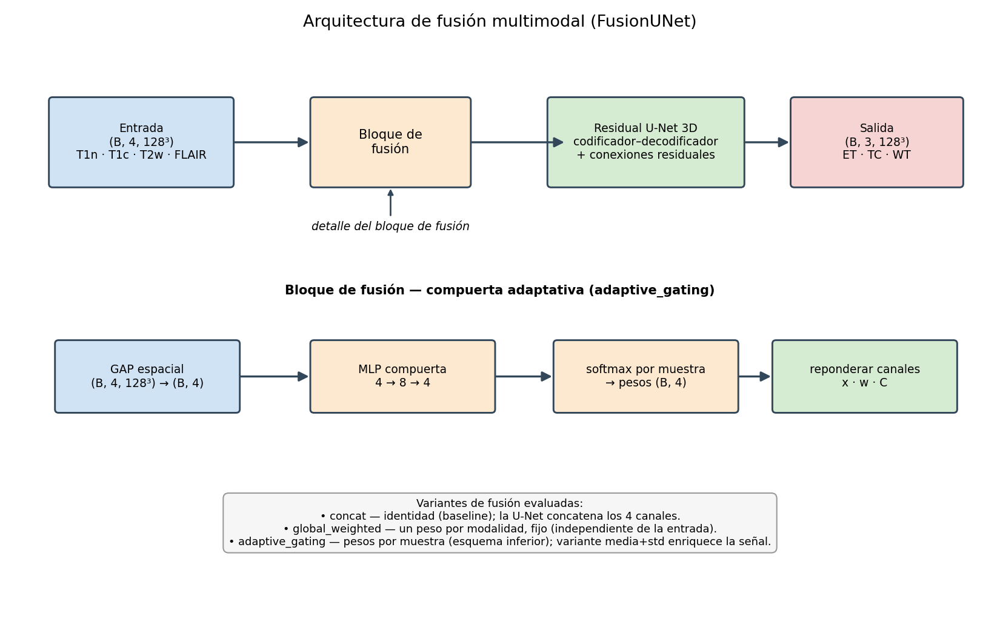

# 4. Desarrollo

Este capítulo describe cómo se materializaron las cinco fases de la metodología. Se detallan la
preparación de los datos, la implementación del *pipeline*, las familias de modelos, las
adaptaciones introducidas durante el desarrollo, el protocolo experimental y la evaluación. La
organización reproduce la del Capítulo 3 para mantener separadas la descripción metodológica
general y las decisiones técnicas concretas.

## 4.1. Familiarización y selección de herramientas (Fase 1)

La fase inicial fijó el alcance del trabajo y las herramientas. Como marco principal se eligió
**MONAI**, biblioteca especializada en imagen médica construida sobre PyTorch, por aportar
transformaciones, estructuras de datos, redes y funciones de pérdida para segmentación 3D. MONAI
proporciona estos componentes, pero el proyecto implementa un bucle de entrenamiento propio para
controlar la precisión mixta, la validación por ventana deslizante, la selección de puntos de control
y el registro de métricas.

Se seleccionaron **cuatro familias de modelos** con funciones diferentes en el estudio: una
Residual U-Net 3D como soporte común de la ablación de fusión; Attention U-Net 3D como variante
convolucional atencional; Swin-UNETR como arquitectura Transformer-UNet; y nnU-Net como *baseline*
externo auto-configurable. Dentro de la familia residual se evaluaron cuatro configuraciones de
entrada: concatenación, ponderación global, compuerta adaptativa basada en la media y compuerta
adaptativa basada en media y desviación típica. La comparación de herramientas y repositorios que
motivó esta selección se presenta en el Capítulo 2.

## 4.2. Análisis y preparación de los datos (Fase 2)

### 4.2.1. Conjunto de datos y descubrimiento de estudios

El alcance experimental se limita a **BraTS-GLI 2024 post-tratamiento**, sin mezclar tareas de otras
colecciones BraTS. Cada estudio aporta cuatro volúmenes MRI 3D en formato NIfTI y su máscara de
segmentación. La configuración `configs/dataset/brats_gli_2024.yaml` declara la raíz de datos, los
directorios `training_data1_v2` y `training_data_additional`, las modalidades y el sufijo de la
máscara. El módulo `tfm_brats/brats.py` recorre ambos directorios, selecciona las carpetas con
prefijo `BraTS-GLI-` y construye las rutas mediante el patrón
`{identificador}-{modalidad}.nii.gz`.

### 4.2.2. Control de calidad

Antes de entrenar se ejecutó el subcomando `qc`, que verifica la presencia de las cuatro modalidades
y de la máscara, la coherencia de dimensiones, espaciado y transformaciones afines, y la ausencia de
etiquetas no permitidas. También calcula los volúmenes de ET, TC y WT que después se emplean para la
estratificación. De este modo se comprobó la integridad de los estudios antes de invertir recursos
de entrenamiento.

### 4.2.3. Particiones estratificadas y reproducibles

La partición se generó con `tfm_brats/splits.py` sobre **1.621 estudios** y con la semilla
`20260526`. El algoritmo combina tres factores en una única clave de estratificación: directorio de
origen, presencia o ausencia de ET y volumen de WT discretizado en cuatro cuantiles. Los resultados
se materializan en `outputs/splits/brats_gli_2024_seed20260526/` como ficheros CSV y TXT, junto con
un manifiesto que registra la semilla, las proporciones y la distribución obtenida. La Tabla 6
presenta el tamaño y el uso de cada partición.

**Tabla 6.** Distribución de las particiones de BraTS-GLI 2024.

| Partición | Estudios | Proporción | Uso |
| :-- | --: | --: | :-- |
| Entrenamiento | 1.135 | 70 % | Ajuste de los parámetros de los modelos MONAI y conjunto de origen de nnU-Net |
| Validación | 243 | 15 % | Monitorización y selección de puntos de control en la *pipeline* MONAI |
| Test | 243 | 15 % | Evaluación final después de congelar las configuraciones |

La tabla muestra que validación y test tienen el mismo tamaño, pero desempeñan funciones distintas:
el test no intervino en la selección de `best.pt`. La separación se realizó por identificador
completo de **estudio de imagen**, no mediante agrupación por sujeto. En consecuencia, no existen
estudios repetidos entre particiones, pero 205 de los 243 estudios de test pertenecen a sujetos con
otro estudio en entrenamiento o validación. Los 38 estudios restantes corresponden a 29 sujetos no
representados en esas particiones. Esta decisión permite la comparación interna bajo un reparto
común, pero impide interpretar el test como una estimación independiente de generalización a
pacientes completamente nuevos.

## 4.3. Diseño e implementación del *pipeline* (Fase 3)

### 4.3.1. Entornos de cómputo

El desarrollo y las corridas finales se repartieron entre un equipo local y Google Colab. La Tabla
7 identifica el entorno efectivo de cada grupo experimental y el tratamiento de la precisión
mixta.

**Tabla 7.** Entornos utilizados en las corridas finales.

| Entorno | Dispositivo | Precisión mixta | Uso final |
| :-- | :-- | :-- | :-- |
| Local | Apple M4 Pro, *backend* MPS | Desactivada | Cuatro configuraciones de fusión sobre la Residual U-Net 3D |
| Google Colab | NVIDIA A100, CUDA | AMP activada en la *pipeline* MONAI | Attention U-Net 3D y Swin-UNETR |
| Google Colab | NVIDIA A100, CUDA | Gestionada por nnU-Net | nnU-Net `3d_fullres`, *fold* 0 |

Esta distribución permitió reservar la A100 para los modelos de mayor coste y para nnU-Net. También
introduce diferencias de dispositivo y precisión entre grupos, por lo que los tiempos de pared y la
comparación global de arquitecturas se interpretan de forma descriptiva. Para reducir el cuello de
botella de Google Drive, los datos usados en la nube se copiaron al disco local del *runtime* antes
de entrenar o preprocesar.

### 4.3.2. Organización del código y flujo de trabajo

El código se organiza como un paquete de Python (`tfm_brats/`) y un árbol de configuraciones YAML
(`configs/`). Los módulos principales son `brats.py`, para las convenciones del conjunto;
`qc.py`, para el control de calidad; `splits.py`, para las particiones; `monai_pipeline.py`, para
transformaciones, carga, modelos, entrenamiento, inferencia y puntos de control; `metrics.py`, para
Dice y HD95; y `cli.py`, para la interfaz de línea de comandos.

Los experimentos MONAI se describen mediante una configuración de datos, otra de modelo y otra de
entrenamiento. Las corridas finales añadieron argumentos explícitos de la CLI para la semilla, el
dispositivo y, en el perfil local, el límite efectivo de 15.000 pasos. Por tanto, la unidad
reproducible completa es la combinación de YAML y comando de ejecución, conservada en
`scratchpad/run_final_fusion_ablation.sh` para la ablación local y en
`notebooks/colab_final_a100.ipynb` para Attention U-Net y Swin-UNETR. nnU-Net utiliza scripts y
comandos nativos independientes, descritos en §4.4.5.

La CLI propia expone cinco subcomandos. La Tabla 8 resume su responsabilidad y deja explícita la
separación entre generar predicciones y evaluarlas.

**Tabla 8.** Subcomandos de la interfaz `tfm_brats/cli.py`.

| Subcomando | Función |
| :-- | :-- |
| `qc` | Comprueba integridad, geometría y etiquetas, y genera estadísticas por estudio. |
| `splits` | Genera las particiones estratificadas y su manifiesto. |
| `train` | Entrena una configuración MONAI y guarda registros y puntos de control. |
| `predict` | Carga un modelo y exporta predicciones NIfTI para una partición. |
| `evaluate` | Lee predicciones ya generadas y calcula Dice y HD95 para ET, TC y WT. |

La tabla refleja un flujo desacoplado: las métricas pueden recalcularse a partir de los NIfTI sin
repetir la inferencia. La Figura 1 ofrece una visión global del sistema, incluidas las ramas que no
comparten el mismo bucle de entrenamiento.



**Figura 1.** Visión global del sistema: BraTS-GLI 2024, control de calidad y particiones; carga y
preprocesamiento; ramas MONAI para Residual U-Net con fusión, Attention U-Net y Swin-UNETR, junto
con la rama externa nnU-Net; y generación de predicciones y evaluación común.

La figura permite distinguir la infraestructura compartida —datos, particiones y métricas finales—
de los dos protocolos de modelado: la *pipeline* MONAI propia y el flujo auto-configurable de
nnU-Net. Dentro de MONAI, solo la rama residual mantiene fija la arquitectura para aislar el efecto
de la fusión.

### 4.3.3. Formulación del problema, modalidades y regiones

Los modelos MONAI reciben un tensor con cuatro canales en el orden T1n, T1c, T2w y T2f, donde T2f
corresponde a FLAIR, y producen tres canales para ET, TC y WT. La Tabla 9 relaciona las entradas con
la información que aportan y las salidas con las etiquetas BraTS utilizadas por el código.

**Tabla 9.** Entradas multimodales y salidas regionales del sistema de segmentación.

| Tipo | Canal o elemento | Información o composición | Relevancia para la segmentación |
| :-- | :-- | :-- | :-- |
| Entrada | T1n | Anatomía y señal T1 sin contraste | Aporta contexto anatómico y alteraciones no definidas por realce |
| Entrada | T1c | Información T1 después de contraste | Ayuda a delimitar el componente con realce, sin sustituir la interpretación conjunta de las modalidades |
| Entrada | T2w | Señal sensible al contenido de agua | Resalta alteraciones ricas en líquido y contribuye a estimar la extensión tumoral |
| Entrada | FLAIR (`t2f`) | Señal T2 con supresión del líquido cefalorraquídeo | Facilita la visualización de hiperintensidades parenquimatosas y del componente periférico de WT |
| Salida | ET, canal 0 | Etiqueta {3} | Región tumoral con realce |
| Salida | TC, canal 1 | Etiquetas {1, 3, 4} | Núcleo tumoral completo |
| Salida | WT, canal 2 | Etiquetas {1, 2, 3, 4} | Extensión tumoral completa |

La tabla muestra por qué la entrada es multimodal: ninguna secuencia resume por sí sola toda la
información usada para construir ET, TC y WT. Los ejemplos del Capítulo 5 complementan esta
descripción al mostrar simultáneamente las regiones predichas sobre un estudio concreto.

Las regiones se representan como máscaras anidadas, ET ⊂ TC ⊂ WT. `BratsRegionsd` transforma la
máscara de etiquetas en tres canales binarios y la salida se formula como segmentación
multietiqueta. Los *logits* se activan con sigmoide y se umbralizan a 0,5. Al exportar la predicción,
`regions_to_labelmap` fuerza la coherencia de inclusión mediante la unión de ET con TC y de TC con
WT, y reconstruye un mapa NIfTI compatible con la evaluación.

### 4.3.4. Preprocesamiento y aumento de datos

La *pipeline* MONAI usa `LoadImaged`, `EnsureChannelFirstd`, normalización por modalidad sobre
vóxeles no nulos (`NormalizeIntensityd(nonzero=True, channel_wise=True)`) y conversión a tensores.
Durante entrenamiento y validación interna también carga la etiqueta y aplica `BratsRegionsd`. La
inferencia de test usa `build_inference_transforms`, que procesa únicamente la imagen; la máscara se
carga después desde `metrics.py` para evaluar la predicción exportada.

El aumento se limita al entrenamiento. `SpatialPadd` asegura un tamaño mínimo de 128³,
`DivisiblePadd(k=16)` mantiene dimensiones compatibles, `RandCropByPosNegLabeld` extrae dos parches
por estudio con razón positiva/negativa 1:1 y `RandFlipd` aplica volteos independientes con
probabilidad 0,5 en los tres ejes. Validación y test no reciben transformaciones aleatorias y se
procesan como volúmenes completos mediante ventana deslizante.

Los datos se sirven con `Dataset` y `DataLoader` de MONAI y la colación `list_data_collate`. Durante
el desarrollo se añadió `build_cached_dataset`, con modos `none`, `memory` y `persistent`, para
adaptar la lectura al entorno. El almacenamiento persistente del conjunto completo resultó poco
práctico por espacio, por lo que las corridas A100 finales usaron `cache_mode: none` después de
copiar los NIfTI desde Google Drive al disco local del *runtime*.

### 4.3.5. Familias de modelos y *factory*

La función `build_model` de `monai_pipeline.py` construye las tres familias integradas en la
*pipeline* propia: Residual U-Net, Attention U-Net y Swin-UNETR. nnU-Net no pasa por esta *factory*:
se ejecuta con su CLI nativa y conserva su planificación, preprocesamiento y entrenamiento. La
Tabla 10 distingue las cuatro familias de modelos y, dentro de la residual, las cuatro variantes de
fusión evaluadas.

**Tabla 10.** Familias y configuraciones finales, ruta de implementación y número de parámetros.

| Familia y configuración | Implementación | Hiperparámetros o rasgo principal | Parámetros |
| :-- | :-- | :-- | --: |
| Residual U-Net + concatenación | MONAI `UNet` + `FusionUNet` | canales (16, 32, 64, 128); `num_res_units=2`; identidad de entrada | 1.190.358 |
| Residual U-Net + ponderación global | MONAI `UNet` + `FusionUNet` | cuatro escalares aprendidos | 1.190.362 (+4) |
| Residual U-Net + compuerta por media | MONAI `UNet` + `FusionUNet` | descriptor 4; MLP 4 → 8 → 4 | 1.190.434 (+76) |
| Residual U-Net + compuerta media+desv. | MONAI `UNet` + `FusionUNet` | descriptor 8; MLP 8 → 8 → 4 | 1.190.466 (+108) |
| Attention U-Net 3D | MONAI `AttentionUnet` | canales (16, 32, 64, 128, 256); cuatro niveles de reducción | 5.910.443 |
| Swin-UNETR | MONAI `SwinUNETR` | `feature_size=48`; profundidades (2, 2, 2, 2); cabezas (3, 6, 12, 24) | 62.191.941 |
| nnU-Net `3d_fullres` | nnU-Net v2, externo | Arquitectura y preprocesamiento auto-configurados | Auto-configurado |

La tabla evidencia dos escalas distintas. Las cuatro configuraciones residuales mantienen fija una
red de aproximadamente 1,19 millones de parámetros y solo cambian el bloque de entrada; Attention
U-Net y, especialmente, Swin-UNETR aumentan la capacidad. nnU-Net se incluye como familia de
referencia, no como una configuración construida por la *factory* ni como parte de la ablación.

La generalización de `build_model` para despachar entre Residual U-Net, Attention U-Net y
Swin-UNETR fue una de las adaptaciones realizadas durante el proyecto. Swin-UNETR admite además
`use_checkpoint`; esta opción se probó para el entorno L4, aunque las corridas finales A100 usaron
la configuración sin *gradient checkpointing*.

### 4.3.6. Mecanismos de fusión multimodal

La comparación principal modifica únicamente el tratamiento de los cuatro canales antes del
codificador residual. `FusionUNet` aplica un módulo de fusión y entrega el tensor resultante a la
misma U-Net:

```python
class FusionUNet(nn.Module):
    def __init__(self, fusion, unet):
        super().__init__()
        self.fusion = fusion
        self.unet = unet

    def forward(self, x):
        return self.unet(self.fusion(x))
```

La Figura 2 representa esta separación entre el bloque de entrada y la red de segmentación, así
como los descriptores usados por las compuertas.



**Figura 2.** Arquitectura de la ablación: cuatro modalidades, bloque de fusión anterior al
codificador, Residual U-Net común y tres canales de salida. El detalle de la compuerta muestra la
obtención de pesos globales por modalidad a partir de descriptores de la entrada.

La figura subraya que la adaptación no es espacial ni se introduce en capas intermedias: produce un
peso por modalidad y muestra, y actúa antes de la primera convolución.

**Concatenación (`concat`).** Se implementa como `nn.Identity()`. No introduce una ponderación
explícita: los cuatro canales llegan directamente a la primera convolución de la U-Net.

**Ponderación global (`global_weighted`).** Aprende cuatro *logits* independientes de la entrada.
Tras aplicar *softmax*, cada canal se multiplica por su peso y por cuatro para preservar la escala
media de activación. Añade cuatro parámetros y aplica la misma combinación a todos los estudios.

**Compuerta adaptativa basada en la media (`adaptive_gating`).** Resume cada canal mediante su media
espacial y procesa los cuatro descriptores con un MLP 4 → 8 → 4. Sus dos capas contienen 76
parámetros: 40 en la primera y 36 en la segunda, incluidos los sesgos. El *softmax* se calcula por
muestra y sus pesos vuelven a escalarse por cuatro.

**Compuerta basada en media y desviación (`adaptive_gating_meanstd`).** Se incorporó después de
observar que la normalización hacía que las medias globales variasen muy poco entre entradas. La
extensión concatena media y desviación típica de cada modalidad, por lo que el descriptor pasa de
cuatro a ocho valores y el MLP 8 → 8 → 4 añade 108 parámetros. La compuerta continúa produciendo
pesos globales por modalidad, no mapas espaciales.

Durante el desarrollo también se añadieron opciones de temperatura del *softmax*, tasa de
aprendizaje específica para la fusión, activación gradual de la compuerta y regularización de
entropía. Estas adaptaciones se exploraron en corridas preliminares de 5.000 pasos para estudiar la
estabilidad. La ablación final mantuvo el protocolo común de optimización y usó temperatura 1, sin
tasa específica, activación gradual ni penalización de entropía, de modo que la variable comparada
fuera el descriptor y el mecanismo de fusión.

## 4.4. Experimentación (Fase 4)

### 4.4.1. Configuración de entrenamiento MONAI

Las configuraciones MONAI finales compartieron los hiperparámetros de optimización de la Tabla 11.
El presupuesto se fijó mediante una sonda larga de la concatenación, cuya validación alcanzó una
meseta aproximada entre 12.000 y 15.000 pasos. Se eligieron 15.000 pasos para las corridas finales;
en el perfil local, cuyo YAML conserva un techo de 25.000, este valor se impuso explícitamente con
`--max-steps 15000`.

**Tabla 11.** Hiperparámetros efectivos del protocolo MONAI final.

| Hiperparámetro | Valor |
| :-- | :-- |
| Optimizador | AdamW |
| Tasa de aprendizaje | 1 × 10⁻⁴ |
| Planificación | *Warmup* lineal de 1.000 pasos hasta la tasa base y decaimiento *cosine* hasta el 1 % de ella |
| *Weight decay* | 1 × 10⁻⁵ |
| Función de pérdida | `DiceCELoss(sigmoid=True, squared_pred=True)` |
| Tamaño de parche | 128 × 128 × 128 |
| Tamaño de lote | 1 estudio, con 2 parches generados por estudio |
| Presupuesto | 15.000 pasos, aproximadamente 13 épocas |
| Semillas | 20260526, 20260527 y 20260528 |

La tabla define un protocolo común para las seis configuraciones MONAI —cuatro configuraciones
residuales, Attention U-Net y Swin-UNETR, cada una con tres semillas—, pero no para nnU-Net. La
igualdad de hiperparámetros permite una ablación controlada dentro de la familia residual. La
comparación entre familias sigue siendo descriptiva porque cambian el dispositivo, AMP y el
solapamiento de inferencia.

`DiceCELoss` combina el término Dice y la entropía cruzada binaria sobre los tres canales. El
planificador se adoptó para distribuir la tasa de aprendizaje dentro del presupuesto fijado; no se
utiliza su incorporación como evidencia causal de superioridad frente a la tasa constante de las
exploraciones preliminares.

### 4.4.2. Bucle de entrenamiento y selección de puntos de control

`train_one_run` gestiona la carga de lotes, el cálculo de la pérdida, la retropropagación, el paso de
AdamW, el planificador y la validación periódica. En CUDA usa autocast y escalado de gradiente; en
MPS ambas funciones permanecen desactivadas. El entrenamiento se limita por número de pasos, aunque
el registro conserva también la época alcanzada.

Al final de cada época —y al alcanzar el límite de pasos— se calcula `mean_dice`, la media de Dice
de ET, TC y WT. Para reducir el coste, esta validación usa un **subconjunto fijo de ocho lotes** del
inicio de `val.csv`; como el cargador de validación tiene tamaño de lote uno y no baraja, equivale a
ocho estudios. Esta métrica selecciona `best.pt`, mientras que `last.pt` conserva el estado más
reciente. La elección del mejor punto de control se basa, por tanto, en ese subconjunto y no en los
243 estudios completos de validación, limitación considerada en el Capítulo 6.

Cada punto de control guarda el estado del modelo y del optimizador, las configuraciones, la época,
el paso global y la mejor métrica observada. `best.pt` es el artefacto utilizado posteriormente por
el subcomando `predict`.

### 4.4.3. Diseño de las comparaciones y reproducibilidad

La **ablación de fusión** constituye la comparación controlada del trabajo. Sus cuatro
configuraciones comparten la Residual U-Net, los estudios y particiones, las transformaciones, la
pérdida, el optimizador, el presupuesto, el entorno MPS y el protocolo de inferencia. Cada una se
entrenó con las tres semillas y sin *ensembling*. Así, las diferencias observadas dentro de esta
ablación pueden asociarse al cambio deliberado del bloque de fusión, dentro de la variabilidad
estocástica medida.

Attention U-Net y Swin-UNETR compartieron entre sí el protocolo MONAI A100, incluidas AMP y tres
semillas. En cambio, la comparación de estas arquitecturas con las residuales no es causal: además
de la arquitectura cambian el dispositivo y el solapamiento de inferencia. nnU-Net se separa aún más
de este protocolo, pues utiliza su propio preprocesamiento y entrenamiento y solo una ejecución del
*fold* 0.

La reproducibilidad práctica se apoya en `set_reproducibility`, que propaga cada semilla a Python,
NumPy, PyTorch y MONAI, y en la conservación de particiones, YAML, comandos, métricas y puntos de
control disponibles. Las tres semillas permiten describir la dispersión de los modelos MONAI, pero
no sustituyen un contraste inferencial con un número mayor de repeticiones.

### 4.4.4. Estudio de ablación de estrategias de fusión

La ablación compara concatenación, ponderación global, compuerta por media y compuerta por
media+desviación sobre la misma Residual U-Net. Además de Dice y HD95, se conservaron los pesos de
la variante global y se diagnosticaron las compuertas finales sobre 40 estudios de validación. Este
análisis cuantifica la variación de los pesos entre entradas, su entropía y la posible concentración
en una modalidad, sin convertir esas observaciones en una explicación causal del rendimiento. Los
resultados se presentan en el Capítulo 5.

### 4.4.5. nnU-Net como referencia externa

nnU-Net se ejecutó fuera de la *factory* MONAI. El script
`scripts/nnunet/prepare_brats_gli_nnunet_full.py` convirtió las particiones al formato nativo de
nnU-Net v2 mediante un NIfTI por modalidad y estudio, con nombres de canal `_0000` a `_0003`, y
conservó las etiquetas 0–4. En el entorno A100 se usó el conjunto `Dataset725_BraTSGLI2024`, se
ejecutaron la planificación y el preprocesamiento propios de nnU-Net y se entrenó la configuración
`3d_fullres`, *fold* 0, con `nnUNetTrainer_250epochs`.

El *fold* interno dividió los 1.135 estudios del conjunto de entrenamiento externo en 908 para
ajuste y 227 para validación. Tras seleccionar `checkpoint_best.pth`, se regeneró `imagesTs` con los
243 estudios del test externo y se realizó la predicción con la CLI nativa. Solo se efectuó una
corrida, sin conjunto de cinco *folds* ni *ensemble*. Sus predicciones se evaluaron con el mismo
`metrics.py` que los modelos MONAI para obtener Dice y HD95 comparables, pero su resultado se trata
como referencia contextual por las diferencias de datos efectivos de ajuste, preprocesamiento,
pérdida, optimizador y presupuesto.

## 4.5. Evaluación y análisis de resultados (Fase 5)

### 4.5.1. Inferencia y exportación de predicciones

Los modelos MONAI se infieren con `sliding_window_inference` sobre ventanas 128³. Las variantes
residuales ejecutadas en MPS usan solapamiento **0,25** y tamaño de lote de ventana 1; Attention
U-Net y Swin-UNETR, ejecutados en A100, usan solapamiento **0,50** y tamaño de lote de ventana 2. El
código no especifica `mode`, por lo que MONAI emplea su mezcla constante predeterminada, no mezcla
gaussiana. nnU-Net utiliza su procedimiento de inferencia propio.

El subcomando `predict` reconstruye el modelo MONAI desde su YAML, carga `best.pt`, aplica sigmoide
y umbral 0,5, fuerza el anidamiento ET ⊂ TC ⊂ WT y guarda un NIfTI por estudio. El subcomando
`evaluate` es posterior e independiente: lee esos NIfTI y las máscaras de referencia y calcula las
métricas. Esta separación permite repetir el cálculo sin volver a ejecutar la red.

### 4.5.2. Métricas de evaluación

El rendimiento se cuantifica con Dice y HD95 por región mediante `tfm_brats/metrics.py`:

- **Dice** mide el solapamiento. Se asigna Dice = 1 cuando predicción y referencia están ambas
  vacías, y Dice = 0 cuando solo una de ellas lo está.
- **HD95** calcula el percentil 95 de las distancias simétricas entre superficies usando el espaciado
  real del NIfTI. Si ambas máscaras están vacías se asigna HD95 = 0; si exactamente una está vacía,
  el resultado es infinito.

Los resúmenes de HD95 conservan los ceros de los casos doblemente vacíos y excluyen los infinitos
del promedio. Por ello, el Capítulo 5 presenta cada media junto al número de estudios con valor
finito. Las métricas son internas y por región; no reproducen el protocolo oculto ni las métricas
*lesion-wise* del reto oficial.

### 4.5.3. Análisis de sensibilidad por sujeto

Tras identificar que la partición estaba definida por estudio, se realizó una comprobación *post
hoc* sobre los 38 estudios de test pertenecientes a 29 sujetos sin presencia en entrenamiento ni
validación. Se reutilizaron las predicciones finales y se recalcularon los agregados de las cuatro
estrategias de fusión. Este análisis comprueba si se mantiene la ordenación descriptiva, pero no
sustituye una partición por sujeto diseñada antes del entrenamiento.

### 4.5.4. Huella computacional

El número de parámetros se obtuvo de los modelos instanciados. En la *pipeline* MONAI, el tiempo de
pared se registra con `perf_counter` desde el inicio del entrenamiento hasta la última validación, y
en CUDA se consulta el máximo de memoria asignada por PyTorch. Esta medida no está disponible de
forma equivalente en MPS. Para nnU-Net, el tiempo se recuperó de las marcas del registro entre el
inicio de la época 0 y `Training done`; no incluye planificación, preprocesamiento, validación final
completa ni inferencia. Al no existir tiempos de inferencia y memoria homogéneos para todos los
modelos, el Capítulo 5 limita la comparación computacional a los registros conservados.

## 4.6. Restricciones y alcance clínico

El sistema segmenta ET, TC y WT en resonancias multimodales post-tratamiento de sujetos incluidos en
BraTS-GLI 2024. No se entrenó con cerebros sanos ni con otras patologías, por lo que no debe
interpretarse como un sistema de detección de tumor ni de diagnóstico diferencial. Tampoco se ha
evaluado en otras instituciones o protocolos de adquisición. A ello se añade que el reparto por
estudio no garantiza independencia por sujeto. En consecuencia, los resultados describen el
comportamiento experimental de los modelos dentro de este conjunto y no una validación clínica para
uso asistencial.
