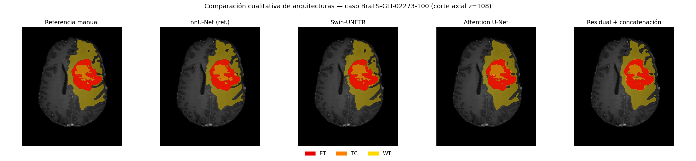

# 5. Resultados

Este capítulo presenta los resultados obtenidos con las configuraciones experimentales descritas en
el Capítulo 4. El análisis se centra en determinar si las estrategias explícitas de ponderación
multimodal mejoran la concatenación directa cuando se mantiene fija la Residual U-Net 3D. A
continuación, los resultados se contextualizan mediante Attention U-Net, Swin-UNETR y la referencia
externa nnU-Net. El capítulo concluye con el análisis de la huella computacional y dos comparaciones
cualitativas.

## 5.1. Alcance del análisis y protocolo de reporte

Las métricas se calcularon sobre la partición denominada `test`, formada por 243 estudios de imagen
cuyos identificadores completos no aparecen en las particiones de entrenamiento o validación. Las
configuraciones basadas en MONAI se entrenaron con las semillas 20260526, 20260527 y 20260528. Para
ellas se presenta la media y la desviación estándar poblacional de las tres corridas. nnU-Net se
entrenó una sola vez con la configuración `3d_fullres` y el *fold* 0, por lo que sus resultados no
incluyen una estimación de variabilidad entre repeticiones.

La partición se generó a nivel de estudio de imagen, no mediante agrupación por sujeto. Debido al
carácter longitudinal del conjunto BraTS-GLI 2024, un mismo sujeto puede aportar más de un estudio y
aparecer en particiones diferentes. Una comprobación posterior identificó que 205 de los 243
estudios de `test` pertenecen a sujetos con algún otro estudio en entrenamiento o validación. Por
ello, las métricas se interpretan como una comparación experimental a nivel de estudio y no como
una estimación independiente de generalización a sujetos completamente nuevos. Este alcance no
impide comparar las estrategias de fusión bajo una partición común, pero limita la interpretación
absoluta de sus valores.

La ablación de fusión constituye la comparación más controlada del trabajo: las cuatro estrategias
comparten la misma Residual U-Net, datos, hiperparámetros, presupuesto de 15.000 pasos y protocolo de
inferencia. Swin-UNETR y Attention U-Net comparten entre sí el protocolo ejecutado en A100. En
cambio, la comparación de estas arquitecturas con las variantes residuales debe considerarse
descriptiva, puesto que se utilizaron entornos de ejecución y valores de solapamiento de ventana
diferentes. nnU-Net empleó además su propio proceso de planificación, preprocesamiento y
entrenamiento.

Las métricas utilizadas son Dice y HD95 para ET, TC y WT. En Dice, los valores más altos indican
mayor solapamiento. En HD95, los valores más bajos indican menor discrepancia entre las superficies.
La implementación asigna HD95 igual a cero cuando predicción y referencia están ambas vacías e
infinito cuando únicamente una de ellas lo está. Los valores infinitos se excluyen posteriormente
del promedio, mientras que los ceros se conservan. En consecuencia, HD95 debe interpretarse junto
con el número de estudios que presentan un valor finito.

Los resultados se analizan descriptivamente. No se realizaron contrastes de hipótesis ni se
definieron márgenes de equivalencia. Asimismo, el presupuesto de 15.000 pasos se fijó a partir de la
sonda descrita en el Capítulo 4, pero no se utiliza para afirmar que todas las arquitecturas
alcanzaran individualmente la convergencia ni para demostrar ausencia de sobreajuste.

## 5.2. Estudio de ablación de las estrategias de fusión

La comparación principal incluye cuatro configuraciones construidas sobre la misma Residual U-Net
3D: concatenación directa, ponderación global estática, compuerta adaptativa basada en la media y
compuerta adaptativa basada en la media y la desviación típica. La Tabla 12 presenta el Dice medio
obtenido por cada semilla.

**Tabla 12.** Dice medio por semilla para las estrategias de fusión evaluadas sobre la misma
Residual U-Net 3D. La última columna muestra la media y la desviación estándar poblacional de las
tres corridas.

| Estrategia de fusión | Semilla 26 | Semilla 27 | Semilla 28 | Media ± desv. |
| :-- | :-: | :-: | :-: | :-: |
| Concatenación (`concat`) | 0,698 | 0,711 | 0,708 | 0,706 ± 0,005 |
| Ponderación global (`global_weighted`) | 0,697 | 0,713 | 0,707 | 0,706 ± 0,006 |
| Compuerta adaptativa (`adaptive_gating`) | 0,702 | 0,710 | **0,347** | 0,586 ± 0,169 |
| Compuerta adaptativa (media+desv.) | 0,711 | **0,349** | 0,714 | 0,592 ± 0,171 |

La concatenación y la ponderación global producen agregados prácticamente coincidentes. La
diferencia media entre ambas es inferior a 0,001 y cambia de signo entre semillas, por lo que no se
observa una mejora consistente asociada a la ponderación estática. Los pesos aprendidos por
`global_weighted` permanecieron, además, próximos a la distribución uniforme: entre 0,244 y 0,254
para las cuatro modalidades y las tres semillas. En este experimento, el bloque no desarrolló una
preferencia marcada por ninguna modalidad.

Las variantes adaptativas presentan un comportamiento diferente. Dos corridas de cada variante
alcanzan valores próximos a los de concatenación y ponderación global, entre 0,702 y 0,714. Sin
embargo, `adaptive_gating` obtiene 0,347 con la semilla 20260528 y la variante media+desviación
obtiene 0,349 con la semilla 20260527. Estas dos ejecuciones se denominan corridas de bajo
rendimiento porque se separan claramente de las otras repeticiones de su configuración. Su
presencia reduce el promedio y eleva la dispersión de las variantes adaptativas.

La observación de una corrida de bajo rendimiento entre tres repeticiones no permite estimar una
probabilidad general de fallo ni determinar su causa. Sí muestra que las variantes adaptativas
presentaron mayor variabilidad entre las semillas ejecutadas que la concatenación y la ponderación
global dentro del presupuesto evaluado.

El análisis de los pesos aporta información adicional. En los tres *checkpoints* finales de la
compuerta basada solo en la media, la desviación entre 40 estudios de validación fue prácticamente
nula. En la variante media+desviación, la máxima desviación por modalidad fue aproximadamente
0,0011. Por tanto, los pesos cambiaron muy poco entre estudios y el comportamiento efectivo de cada
*checkpoint* fue próximo al de una ponderación estática.

No se observó, sin embargo, una concentración de la compuerta en una única modalidad. Las entropías
medias se situaron entre 1,353 y 1,380, próximas al máximo de ln(4) = 1,386, y ningún peso medio
superó 0,345. Las corridas de bajo Dice deben interpretarse, por tanto, como un deterioro del
rendimiento global durante la optimización, no como un colapso de la compuerta sobre una modalidad
concreta. La escasa variación de los pesos sugiere que los descriptores globales utilizados
aportaron una señal limitada para adaptar la fusión a cada entrada, aunque este diagnóstico no
demuestra por sí solo la causa del rendimiento observado.

Como comprobación de sensibilidad, se repitió el agregado sobre los 38 estudios correspondientes a
29 sujetos que no aparecen ni en entrenamiento ni en validación. En este subconjunto *post hoc*, la
concatenación obtuvo 0,751 ± 0,003; la ponderación global, 0,750 ± 0,006; la compuerta adaptativa,
0,617 ± 0,192; y la variante media+desviación, 0,620 ± 0,194. La ordenación se mantiene y respalda
la interpretación principal de la ablación. El reducido tamaño del subconjunto impide utilizarlo
como sustituto de una evaluación independiente más amplia.

En conjunto, los experimentos no aportan evidencia de que las estrategias adaptativas evaluadas
mejoren de forma consistente la concatenación directa. Dentro de este montaje, la concatenación fue
la alternativa más parsimoniosa y, junto con la ponderación global, la que presentó menor
variabilidad entre semillas.

## 5.3. Comparación descriptiva de arquitecturas

La Tabla 13 amplía el análisis con Attention U-Net, Swin-UNETR y nnU-Net. La tabla muestra el Dice
por región y la media de ET, TC y WT. Los valores de las configuraciones MONAI corresponden a tres
semillas; nnU-Net procede de una única corrida de referencia.

**Tabla 13.** Coeficiente Dice en la partición de evaluación. Para las configuraciones con tres
semillas se presenta media ± desviación estándar poblacional.

| Modelo | n | Dice medio | ET | TC | WT |
| :-- | :-: | :-: | :-: | :-: | :-: |
| nnU-Net `3d_fullres`, fold 0 | 1 | 0,829 | 0,713 | 0,864 | 0,911 |
| Swin-UNETR | 3 | 0,752 ± 0,017 | 0,624 ± 0,011 | 0,774 ± 0,020 | 0,857 ± 0,019 |
| Attention U-Net 3D | 3 | 0,735 ± 0,006 | 0,572 ± 0,013 | 0,770 ± 0,003 | 0,861 ± 0,002 |
| Residual U-Net + concatenación | 3 | 0,706 ± 0,005 | 0,548 ± 0,009 | 0,729 ± 0,010 | 0,841 ± 0,004 |
| Residual U-Net + ponderación global | 3 | 0,706 ± 0,006 | 0,550 ± 0,013 | 0,727 ± 0,009 | 0,840 ± 0,004 |
| Residual U-Net + compuerta adaptativa | 3 | 0,586 ± 0,169 | 0,404 ± 0,200 | 0,585 ± 0,205 | 0,770 ± 0,102 |
| Residual U-Net + compuerta media+desv. | 3 | 0,592 ± 0,171 | 0,419 ± 0,211 | 0,591 ± 0,209 | 0,765 ± 0,095 |

nnU-Net alcanza el mayor Dice medio observado, con 0,829. Este resultado se utiliza como referencia
contextual fuerte, no como una ablación controlada de arquitectura. nnU-Net empleó su propio
preprocesamiento, aumento de datos, función de pérdida, optimizador y planificación, además de un
*checkpoint* seleccionado mediante su *fold* interno. Solo se ejecutó una corrida, por lo que
tampoco es posible estimar su variabilidad entre semillas.

Swin-UNETR alcanza el mayor Dice medio entre las configuraciones MONAI, con 0,752 ± 0,017, seguido
de Attention U-Net con 0,735 ± 0,006. Ambos modelos compartieron el protocolo A100, lo que permite
una comparación descriptiva más directa. Swin-UNETR obtuvo una media superior en dos semillas,
mientras que Attention U-Net alcanzó el mejor resultado en la semilla 20260528. Attention U-Net
presentó además una dispersión menor entre repeticiones. Con tres semillas puede describirse esta
ordenación, pero no establecer una superioridad estadística.

La principal diferencia regional entre ambos modelos aparece en el Dice agregado de ET: 0,624 para
Swin-UNETR y 0,572 para Attention U-Net. ET está presente en 182 de los 243 estudios y ausente en
los 61 restantes. Al restringir el cálculo a los estudios con ET presente, los resultados se
aproximan: alrededor de 0,735 para Swin-UNETR y 0,731 para Attention U-Net. Por tanto, una parte
importante de la diferencia agregada procede de la detección correcta de la ausencia de ET y no
exclusivamente de una mayor precisión del contorno cuando la región está presente.

La comparación global con las Residual U-Net debe mantenerse en el plano contextual. Aunque los
modelos MONAI compartieron el mismo presupuesto de entrenamiento, las configuraciones ejecutadas
localmente utilizaron un solapamiento de ventana de 0,25 y las ejecutadas en A100 utilizaron 0,50.
La tabla permite describir los resultados obtenidos por cada configuración, pero no atribuir toda
la diferencia observada exclusivamente a la arquitectura.

La Tabla 14 muestra HD95. Para las configuraciones con tres semillas, cada celda contiene la media
y la desviación estándar de los tres promedios por corrida. Entre corchetes se indica el intervalo
del número de estudios con HD95 finito. En nnU-Net se presenta el denominador de su única corrida.

**Tabla 14.** HD95 en milímetros y número de estudios con valor finito. Un valor menor indica menor
discrepancia de superficie entre los casos incluidos en el promedio.

| Modelo | HD95 ET [n finitos] | HD95 TC [n finitos] | HD95 WT [n finitos] |
| :-- | :-: | :-: | :-: |
| nnU-Net `3d_fullres`, fold 0 | 2,95 [207] | 3,27 [238] | 3,33 [242] |
| Swin-UNETR | 5,76 ± 0,34 [197–201] | 7,26 ± 1,14 [236–238] | 7,60 ± 1,00 [242–243] |
| Attention U-Net 3D | 8,31 ± 0,45 [186–191] | 8,93 ± 0,70 [236–237] | 7,88 ± 0,52 [243] |
| Residual U-Net + concatenación | 8,75 ± 1,05 [192–194] | 11,00 ± 1,37 [237–239] | 10,28 ± 0,58 [243] |
| Residual U-Net + ponderación global | 8,90 ± 0,80 [193–194] | 11,30 ± 0,86 [236–238] | 10,66 ± 0,16 [243] |
| Residual U-Net + compuerta adaptativa | 23,83 ± 20,03 [182–195] | 24,52 ± 18,25 [237–238] | 17,17 ± 9,46 [243] |
| Residual U-Net + compuerta media+desv. | 22,85 ± 20,98 [182–195] | 23,62 ± 19,52 [237–239] | 17,78 ± 10,77 [243] |

La ordenación descriptiva de HD95 es compatible, en términos generales, con la observada en Dice.
nnU-Net presenta los valores más bajos y Swin-UNETR los menores entre las configuraciones MONAI.
Las variantes adaptativas muestran medias y desviaciones mayores debido principalmente a sus
corridas de bajo rendimiento.

Estos valores no deben interpretarse de forma aislada. El promedio incluye los casos en los que
predicción y referencia están ambas vacías, con HD95 igual a cero, pero excluye los casos en los que
solo una de ellas está vacía. Por esta razón, una cifra inferior puede depender tanto de la precisión
de las superficies como de los casos que han quedado fuera del agregado.

## 5.4. Huella computacional

La Tabla 15 resume el número exacto de parámetros y los tiempos de entrenamiento conservados en los
registros finales. En las configuraciones MONAI, los tiempos representan duración de pared hasta la
última validación. Debido a las diferencias entre MPS, CUDA y el protocolo propio de nnU-Net, no se
emplean para establecer una ordenación general de eficiencia entre arquitecturas.

**Tabla 15.** Parámetros, entorno y coste registrado. «No registrado» indica que el artefacto
necesario no se conservó o que el mecanismo de registro no era compatible con el entorno.

| Modelo o configuración | Parámetros | Incremento | Entorno | Tiempo por corrida | Memoria máxima registrada |
| :-- | --: | --: | :-- | :-: | :-: |
| Residual U-Net + concatenación | 1.190.358 | — | M4 Pro (MPS) | 4,99–5,00 h | No registrada |
| Residual U-Net + ponderación global | 1.190.362 | +4 | M4 Pro (MPS) | 5,65–5,81 h | No registrada |
| Residual U-Net + compuerta adaptativa | 1.190.434 | +76 | M4 Pro (MPS) | 5,67–6,02 h | No registrada |
| Residual U-Net + compuerta media+desv. | 1.190.466 | +108 | M4 Pro (MPS) | 5,79–5,88 h | No registrada |
| Attention U-Net 3D | 5.910.443 | — | A100 (CUDA) | 2,14 h\* | 6,52 GiB\* |
| Swin-UNETR | 62.191.941 | — | A100 (CUDA) | No registrado | No registrada |
| nnU-Net `3d_fullres` | Auto-configurado | — | A100 (CUDA) | 4,77 h\*\* | No registrada |

\* El tiempo y la memoria de Attention U-Net corresponden únicamente a la semilla 20260528, cuyo
registro fue el único conservado de las corridas A100.

\*\* El tiempo de nnU-Net se calculó desde el inicio de la época 0 hasta el mensaje de finalización
del entrenamiento. Incluye las validaciones internas de las 250 épocas, pero no la planificación, el
preprocesamiento, la validación final completa del *fold* ni la inferencia sobre el conjunto de test.

Los mecanismos de fusión añaden pocos parámetros respecto a la red base: cuatro para la ponderación
global, 76 para la compuerta basada en la media y 108 para la variante media+desviación. Este
incremento es pequeño en relación con los aproximadamente 1,19 millones de parámetros de la
Residual U-Net.

El reducido número de parámetros adicionales no implica un coste temporal nulo. En el entorno MPS,
la concatenación requirió aproximadamente cinco horas por corrida, mientras que las variantes con
ponderación necesitaron entre 5,65 y 6,02 horas. Estas diferencias son tiempos de pared observados y
pueden incluir variaciones de carga, entrada/salida y validación, por lo que no permiten aislar con
precisión el coste del bloque de fusión.

Swin-UNETR contiene aproximadamente 52 veces más parámetros que la Residual U-Net y fue entrenado
en A100. Sus registros finales de tiempo y memoria no se conservaron por separado para las tres
semillas, por lo que no se incluyen estimaciones indirectas. En nnU-Net pudo recuperarse una duración
de 4,77 horas a partir del registro del entrenamiento, pero no una medida de memoria máxima. Tampoco
se registró de forma homogénea el tiempo de inferencia. En consecuencia, el análisis computacional
demuestra que las fusiones son ligeras en número de parámetros y documenta los tiempos disponibles,
pero no permite comparar de forma completa la eficiencia de todas las arquitecturas.

## 5.5. Análisis cualitativo

Las métricas agregadas se complementaron mediante la inspección del estudio
BraTS-GLI-02273-100. Este estudio pertenece a un sujeto no representado en entrenamiento ni
validación y se seleccionó con finalidad ilustrativa: contiene las tres regiones con extensión
visible y permite distinguir sus diferencias en un mismo corte. La selección favorece además un
caso en el que la concatenación obtiene un resultado adecuado, por lo que no debe considerarse
representativa de la distribución completa.

La Figura 3 muestra el corte axial de mayor extensión de WT. Las cuatro configuraciones reproducen
la extensión principal de la lesión, aunque presentan diferencias locales en los límites y en la
distribución interna de ET y TC. Estas observaciones se restringen al ejemplo mostrado y se utilizan
únicamente como complemento visual de las métricas agregadas.

**Figura 3.** Comparación cualitativa sobre el estudio BraTS-GLI-02273-100, en el corte axial de
mayor extensión de WT. De izquierda a derecha: referencia manual, nnU-Net, Swin-UNETR, Attention
U-Net y Residual U-Net con concatenación. Las configuraciones MONAI mostradas corresponden a la
semilla 20260526.

La Figura 4 compara, para el mismo estudio y corte, la concatenación de la semilla 20260526 con la
compuerta adaptativa de la semilla 20260528, correspondiente a la corrida de bajo rendimiento
identificada en la Tabla 12. En este ejemplo, la segunda predicción sobreestima ET y representa con
menor precisión la distribución interna de las regiones. La figura ilustra el tipo de error
producido por esa corrida concreta, sin utilizarse como evidencia independiente del comportamiento
general de la estrategia.

**Figura 4.** Ejemplo cualitativo de una corrida de bajo rendimiento de `adaptive_gating`. De
izquierda a derecha: referencia manual, concatenación (semilla 20260526) y compuerta adaptativa
(semilla 20260528).

## 5.6. Síntesis de los resultados

Los resultados permiten establecer las siguientes observaciones dentro del alcance del montaje
experimental:

1. La concatenación y la ponderación global producen valores prácticamente coincidentes. Los pesos
   aprendidos por la ponderación global permanecen próximos a una distribución uniforme.
2. Las compuertas adaptativas no muestran una mejora consistente y presentan mayor variabilidad
   entre semillas debido a una corrida de bajo rendimiento en cada variante.
3. Los pesos de las compuertas cambian muy poco entre estudios. La variante media+desviación aumenta
   la información de entrada del bloque, pero la variación observada entre estudios sigue siendo
   muy pequeña y no se obtiene una mejora consistente.
4. nnU-Net obtiene el mayor rendimiento numérico y actúa como referencia externa. Entre las
   configuraciones MONAI, Swin-UNETR alcanza el mayor Dice medio, aunque la comparación completa de
   arquitecturas es contextual y no una ablación causal.
5. Las estrategias de fusión añaden pocos parámetros. Sus tiempos de pared fueron mayores que los
   de la concatenación en las ejecuciones locales, aunque el diseño no permite atribuir esta
   diferencia exclusivamente al bloque de fusión.

En respuesta a la pregunta de investigación, bajo las configuraciones, el presupuesto y la
partición utilizados no se obtuvo evidencia de que la ponderación adaptativa ligera mejore de forma
consistente la concatenación directa. Este resultado negativo delimita las condiciones en las que
los mecanismos evaluados no aportaron la ventaja esperada y constituye la base de las conclusiones
del Capítulo 6.
