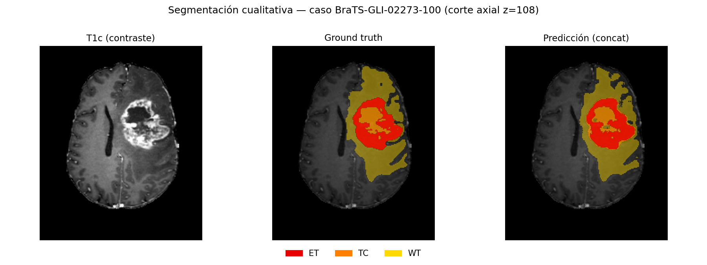
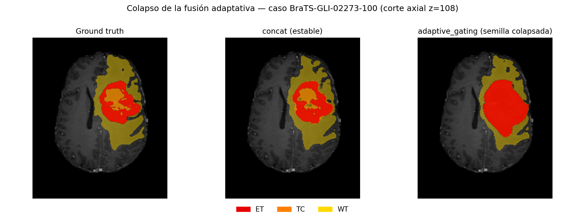

# 5. Resultados

> Resultados finales sobre el conjunto de **test** reservado (243 casos), obtenidos con el
> protocolo de convergencia del Capítulo 4 (15.000 pasos, planificador *cosine*, tres semillas por
> modelo). Numeración de tablas **consecutiva global**, continuando desde el Capítulo 4. Fuente de
> los datos: `outputs/evaluation/final_all_test.csv` y los resúmenes por corrida.

## 5.1. Protocolo de evaluación

Todas las cifras de este capítulo se calculan sobre el conjunto de **test**, que permaneció
reservado durante todo el desarrollo y solo se evaluó una vez congelada la configuración de
entrenamiento (§4.4). Cada modelo propio se entrenó con **tres semillas** (20260526, 20260527,
20260528) y se reporta la **media ± desviación típica** de las tres. El *baseline* fuerte nnU-Net
se entrenó una única vez (`3d_fullres`, *fold* 0) y actúa como **referencia**, por lo que no lleva
desviación. Las métricas son el coeficiente **Dice** y la distancia de **Hausdorff al percentil 95
(HD95)**, calculadas por región (ET, TC, WT) según §4.5.2.

## 5.2. Comparativa de arquitecturas

La Tabla 11 presenta el Dice por región y el Dice medio de las tres regiones para las siete
configuraciones evaluadas. La Tabla 12 recoge la métrica de frontera HD95 para las mismas.

**Tabla 11.** Coeficiente Dice sobre test (media ± desviación típica de tres semillas; nnU-Net es
una corrida de referencia). En negrita, el mejor valor de cada columna entre los modelos propios.

| Modelo | Dice medio | ET | TC | WT |
| :-- | :-: | :-: | :-: | :-: |
| nnU-Net 3d_fullres (referencia) | 0,829 | 0,713 | 0,864 | 0,911 |
| Swin-UNETR | **0,752 ± 0,017** | **0,624 ± 0,011** | **0,774 ± 0,020** | 0,857 ± 0,019 |
| Attention U-Net | 0,735 ± 0,006 | 0,572 ± 0,013 | 0,770 ± 0,003 | **0,861 ± 0,002** |
| Residual U-Net + concat | 0,706 ± 0,005 | 0,548 ± 0,009 | 0,729 ± 0,010 | 0,841 ± 0,004 |
| Residual U-Net + global_weighted | 0,706 ± 0,006 | 0,550 ± 0,013 | 0,727 ± 0,009 | 0,840 ± 0,004 |
| Residual U-Net + adaptive_gating | 0,586 ± 0,169 | 0,404 ± 0,200 | 0,585 ± 0,205 | 0,770 ± 0,102 |
| Residual U-Net + adaptive_gating (media+std) | 0,592 ± 0,171 | 0,419 ± 0,211 | 0,591 ± 0,209 | 0,765 ± 0,095 |

**Tabla 12.** Distancia HD95 (mm) sobre test por región (media de tres semillas; nnU-Net,
referencia). Valores menores son mejores. El HD95 se promedia solo sobre los casos con la región
presente en predicción y referencia; en ET el número de casos finitos oscila entre 182 y 207 de
243 según el modelo (menor cuando el modelo omite la región).

| Modelo | HD95 ET | HD95 TC | HD95 WT |
| :-- | :-: | :-: | :-: |
| nnU-Net 3d_fullres (referencia) | 2,95 | 3,27 | 3,33 |
| Swin-UNETR | 5,76 | 7,26 | 7,60 |
| Attention U-Net | 8,31 | 8,93 | 7,88 |
| Residual U-Net + concat | 8,75 | 11,00 | 10,28 |
| Residual U-Net + global_weighted | 8,90 | 11,30 | 10,66 |
| Residual U-Net + adaptive_gating | 23,83 | 24,52 | 17,17 |
| Residual U-Net + adaptive_gating (media+std) | 22,85 | 23,62 | 17,78 |

Del contraste de arquitecturas (Tablas 11 y 12) se observa una **jerarquía clara**:

- **nnU-Net** es el mejor modelo con diferencia (Dice medio 0,829), y su ventaja es especialmente
  marcada en la métrica de frontera: sus HD95 (~3 mm en las tres regiones) son de dos a tres veces
  menores que los de cualquier modelo propio, lo que indica contornos mucho más limpios. Confirma
  su papel de techo de referencia y de baseline fuerte auto-configurable.
- **Swin-UNETR** es el mejor de los modelos propios (Dice medio 0,752), superando al Attention
  U-Net sobre todo en ET (0,624 frente a 0,572), la región más difícil. Este resultado respalda la
  elección del Transformer-UNet que da nombre al trabajo.
- **Attention U-Net** (0,735) y la familia residual con fusión estable (~0,706) completan la
  jerarquía. La región **ET es sistemáticamente la más difícil** en todos los modelos, y **WT la
  más fácil**, patrón esperado por el tamaño y la frecuencia de cada región.
- La consistencia entre validación (usada para seleccionar *checkpoint*) y test es alta —por
  ejemplo, nnU-Net obtuvo 0,835 en validación y 0,829 en test—, lo que indica **ausencia de
  sobreajuste** apreciable al protocolo de selección.

## 5.3. Estudio de ablación de estrategias de fusión

El estudio de ablación compara, sobre la **misma** U-Net residual 3D, las cuatro estrategias de
fusión (§4.3.6). La Tabla 13 desglosa el Dice medio por semilla, lo que resulta esencial para
interpretar la elevada desviación de las variantes adaptativas.

**Tabla 13.** Dice medio sobre test por semilla para las cuatro estrategias de fusión (misma U-Net
residual 3D). Se resaltan las semillas en las que la compuerta adaptativa colapsa.

| Estrategia de fusión | Semilla 26 | Semilla 27 | Semilla 28 | Media ± desv. |
| :-- | :-: | :-: | :-: | :-: |
| concat (*baseline*) | 0,698 | 0,711 | 0,708 | 0,706 ± 0,005 |
| global_weighted | 0,697 | 0,713 | 0,708 | 0,706 ± 0,006 |
| adaptive_gating | 0,702 | 0,710 | **0,347** | 0,586 ± 0,169 |
| adaptive_gating (media+std) | 0,711 | **0,349** | 0,714 | 0,592 ± 0,171 |

Los resultados de la ablación son concluyentes:

- **Ninguna estrategia de fusión supera a la concatenación.** La concatenación (`concat`, 0,706) y
  la ponderación global estática (`global_weighted`, 0,706) son **estadísticamente indistinguibles**
  y ambas muy estables (desviación ± 0,005–0,006). Es decir, reponderar las modalidades a la
  entrada —de forma estática— no aporta ninguna mejora sobre concatenarlas.
- **La fusión adaptativa es inestable.** Ambas variantes de compuerta obtienen una media claramente
  inferior (0,586 y 0,592) y una desviación típica ~30 veces mayor. La causa es visible en la
  Tabla 13: **cada variante colapsa en una de las tres semillas** —`adaptive_gating` en la semilla
  28 (0,347) y la variante media+std en la semilla 27 (0,349)—. Que el colapso ocurra en semillas
  **distintas** descarta que sea un problema de una inicialización concreta: la compuerta adaptativa
  introduce un riesgo de fallo del entrenamiento (~1 de cada 3 corridas) que las estrategias
  estáticas no presentan. Los HD95 desorbitados de estas dos filas en la Tabla 12 (~23 mm) son
  reflejo de ese mismo colapso.
- Un diagnóstico complementario reveló que, incluso en las semillas en que no colapsa, la compuerta
  aprende pesos **casi idénticos entre casos** (su señal de condicionamiento es prácticamente
  constante tras la normalización), de modo que su comportamiento efectivo es el de una ponderación
  estática —equivalente a `global_weighted`— pero pagando el precio de la inestabilidad. La variante
  con descriptor enriquecido (media+std) se diseñó para dotarla de una señal por caso, sin lograr
  evitar el colapso.

En conjunto, la ablación indica que **la complejidad añadida por la fusión adaptativa no se
justifica**: no mejora el rendimiento y compromete la robustez. La concatenación se confirma como
estrategia de fusión simple, robusta y suficiente. La interpretación de este resultado como
contribución (estudio crítico de estrategias de fusión) se desarrolla en el Capítulo 6.

## 5.4. Coste computacional

La Tabla 14 resume el coste de cada arquitectura. Los modelos residuales (incluidas las variantes
de fusión) comparten el mismo tamaño (~1,19 M parámetros); los bloques de fusión añaden un coste
despreciable (4 y 48 parámetros). El Swin-UNETR es ~50 veces mayor que el *baseline* residual, lo
que motivó su entrenamiento en GPU A100 y el uso opcional de *gradient checkpointing*.

**Tabla 14.** Coste computacional por modelo: número de parámetros, entorno de entrenamiento y
memoria de GPU aproximada. Los tiempos no son directamente comparables entre entornos (MPS vs.
CUDA A100) y se ofrecen solo como orden de magnitud.

| Modelo | Parámetros | Entorno | Memoria GPU aprox. |
| :-- | :-: | :-- | :-: |
| Residual U-Net (concat / fusión) | ~1,19 M | M4 Pro (MPS) | < 2 GB |
| Attention U-Net | ~5,91 M | A100 (CUDA) | moderada |
| Swin-UNETR | ~62,19 M | A100 (CUDA) | ~13 GB |
| nnU-Net 3d_fullres | auto-configurada | A100 (CUDA) | ~9 GB |

El coste añadido por la fusión adaptativa (48 parámetros) es insignificante en cómputo, pero su
coste **real** —no reflejado en la tabla— es la pérdida de robustez documentada en §5.3: el riesgo
de tener que descartar y repetir entrenamientos colapsados. Este es un argumento adicional, de
eficiencia, en contra de adoptar la fusión adaptativa.

## 5.5. Resultados cualitativos

Además de las métricas agregadas, resulta ilustrativo inspeccionar las segmentaciones. La Figura 1
muestra, para un caso de test representativo (BraTS-GLI-02273-100), el corte axial con mayor
extensión tumoral: la secuencia T1c de fondo, el *ground truth* y la predicción del modelo residual
con concatenación. Las regiones se muestran anidadas (WT en amarillo, TC en naranja, ET en rojo). La
predicción reproduce fielmente la extensión del tumor completo y del núcleo realzante, con
diferencias menores en los bordes del edema.

**Figura 1.** Segmentación cualitativa sobre un caso de test (BraTS-GLI-02273-100, corte axial). De
izquierda a derecha: secuencia T1c, *ground truth* y predicción del modelo residual con
concatenación. Regiones anidadas ET ⊂ TC ⊂ WT.

La Figura 2 ilustra visualmente el colapso de la fusión adaptativa descrito en §5.3. Sobre el mismo
caso y corte, se comparan el *ground truth*, la predicción del modelo con concatenación (estable) y
la de la compuerta adaptativa en una semilla colapsada. Mientras la concatenación delimita
correctamente las tres regiones, la compuerta colapsada produce una **masa realzante amorfa** que
sobreestima groseramente el ET e ignora la estructura anidada del tumor: una confirmación visual del
fallo que las métricas de §5.3 cuantifican.

**Figura 2.** Ilustración del colapso de la fusión adaptativa (mismo caso y corte que la Figura 1).
De izquierda a derecha: *ground truth*, predicción del modelo con concatenación (estable) y
predicción de la compuerta adaptativa en una semilla colapsada.

(Las figuras se han generado con las predicciones de la familia residual disponibles en local; la
numeración de figuras es consecutiva global y se consolidará junto con los diagramas de los
Capítulos 2 y 4 al integrar la memoria.)

## 5.6. Síntesis de resultados

Los resultados finales sobre test permiten responder a la pregunta de investigación con evidencia
sólida (convergencia, conjunto reservado y multi-semilla):

1. En la comparación de arquitecturas, **nnU-Net** marca el techo de referencia (0,829) y
   **Swin-UNETR** es el mejor modelo propio (0,752), respaldando la orientación Transformer-UNet
   del trabajo.
2. En el estudio de ablación, **ninguna estrategia de fusión supera a la concatenación**; las
   variantes adaptativas, además, son inestables (colapsan en ~1 de cada 3 semillas).
3. La contribución se reformula, por tanto, como un **estudio crítico de estrategias de fusión
   multimodal**: un resultado negativo, pero riguroso y defendible, cuyo desarrollo e implicaciones
   se abordan en las conclusiones (Capítulo 6).
